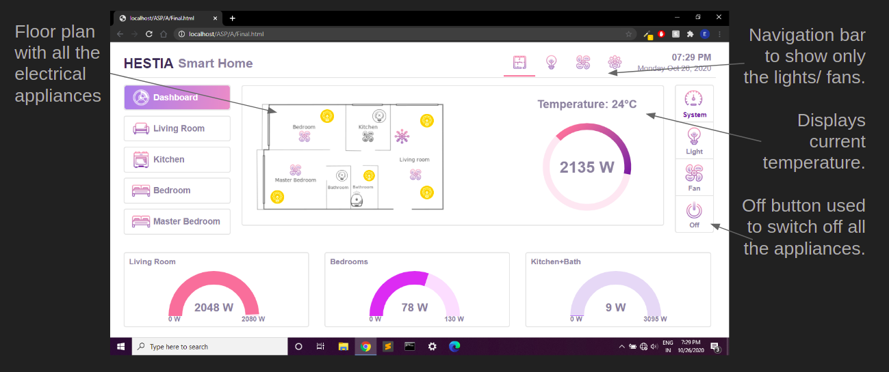
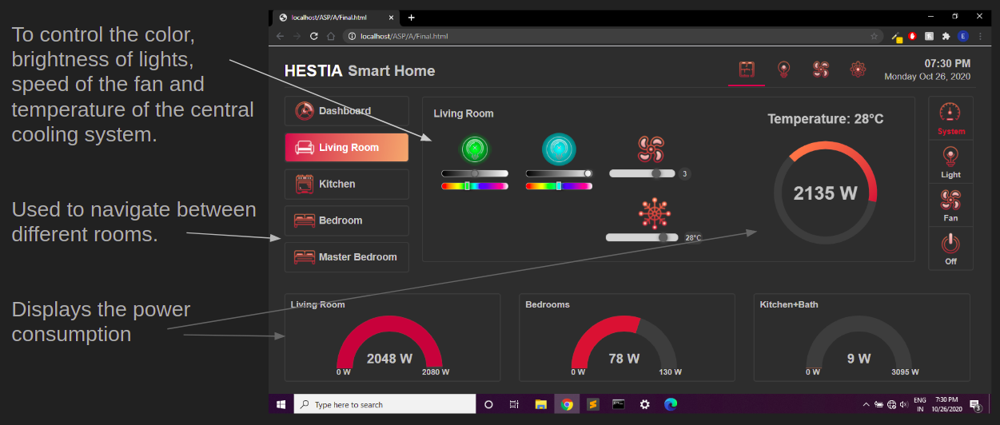

# HestiaSmartHomes
It is a web based UI for control of the home automation system.
It is created using classic ASP. It has controls for lights, fans and other common appliances. Additionally it has a feature to monitor the instantaneous power consumption of all the lights, fans, appliances in your home as well as cumulative power. It also has 2 themes.

## Execution
index.html is the first page which is to be opened. IIS should be installed for running ASP scripts. This link can be used for IIS installation: https://www.howtogeek.com/112455/how-to-install-iis-8-on-windows-8/

## File storage
The whole file structure should be stored in wwwroot in inetpub.

## Snapshots
<kbd></kbd>
<kbd></kbd>
